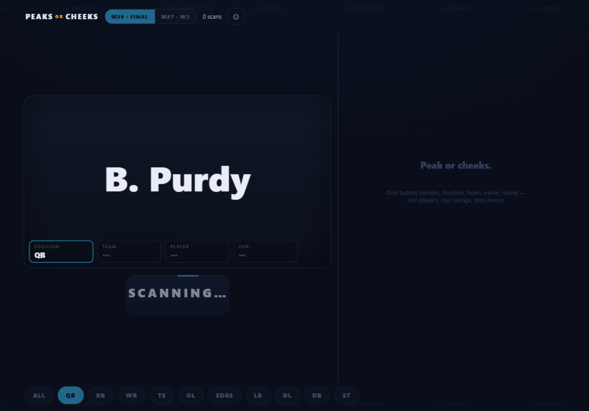
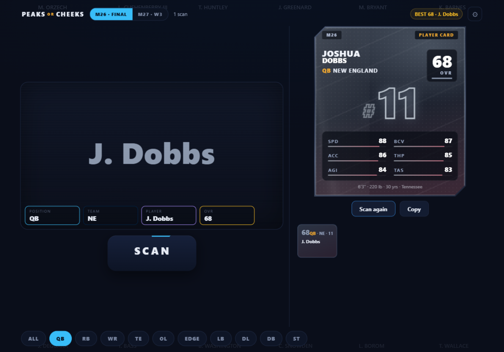

<div align="center">

# PEAKS <em>or</em> CHEEKS

**One button. Two fates. Pull a player and find out which one you are today.**

A random pro-football player generator with slot-machine DNA,
real published ratings, and a house cheek rate of **90.5%**.

[▶ Play it live][pages] · [The con](#the-con) · [Run it locally](#run-it-locally) · [FAQ](#faq)



*That 97 that just flashed by your window? It never existed. The house always wings.*

</div>

---

Every scan locks in a real player — position, team, name, rating — with the
slow-motion dread of a slot machine that hired a very expensive graphic designer.
The stream blurs. The locks slam, one by one. The name reel stretches a little
too long when something good is coming (if you know what to listen for). Then
the card lands and the universe tells you exactly what it thinks of you.

- **PEAK** — you pulled a dude. Screenshot it. Ruin your group chat's day.
- **CHEEKS** — you did not pull a dude. The app will still play you a nice
  little sound. That's the respect you get.



## The con

| Feature | What it actually is |
|---|---|
| 🔋 **Hold-to-charge SCAN** | Press, hold, feel the haptic ramp climb, release. Quick taps work too — the charge is theater. |
| 🎰 **A slot machine in a trench coat** | Staggered locks, near-miss flashes, a deceleration curve tuned by someone with regrets. Outcome is decided the instant you release. Everything after that is performance. |
| 🔊 **Synthesized sound design** | Zero audio files. Every tick, lock-thunk, riser, and legend stinger is generated live on the Web Audio clock. |
| 📳 **Haptics** | Full vibration vocabulary on Android. iPads get a visual pulse stand-in, because Apple said no. |
| 🎨 **Team-color card art** | The jersey number is the artwork — duotone team gradients, chamfered chrome frame, no logos, no likenesses, just palette and type. |
| 🔄 **Two rating sources** | Final roster of last year's game, or live weekly ratings of the current one. One toggle, separate session stats. |
| 📊 **Real attributes** | Every card's stats are the game's actual published values. The disrespect is statistically accurate. |
| 📴 **Offline PWA** | Install it, airplane-mode it, keep pulling cheeks at 30,000 feet. |
| 🆓 **No economy** | No coins. No energy. No pity timer. Infinite scans. The only currency is hope. |

## The house rules

| Outcome | Odds |
|---|---|
| Legend (the peak) | 1.5% |
| Elite | 8% |
| Rare | 30% |
| Common (statistically: cheeks) | 60.5% |

We are not sorry. Scarcity is what makes the peaks peak.

## Use it

**[▶ PLAY IN YOUR BROWSER][pages]**

Best on a tablet. Add it to your home screen — it's a PWA and it will behave.

## Run it locally

```bash
cd rollout
npm ci
npm run dev        # develop at http://localhost:5174
npm test           # 32 tests, zero mercy
npm run build && npx vite preview   # production build at :4174
```

Requires Node 22+. That's it — the full player dataset ships in the repo.

## Refresh the data

The current-game ratings move weekly; the pipeline refetches on demand:

```bash
cd pipeline
uv sync
uv run fetch_madden.py --game 27   # current game, latest week → data/madden27.json
uv run fetch_madden.py --game 26   # last game's final roster (immutable one-shot)
cd ../rollout && npm run build
```

## What's in the repo

| Path | What lives there |
|---|---|
| `rollout/` | **Peaks or Cheeks** — the player generator (React + Vite + TS, Web Audio, PWA) |
| `app/` | **RipPack v1** — the pack-opening game this was built from (still works; its own tests + Playwright e2e: `cd app && npm test && npm run e2e`) |
| `pipeline/` | Python data pipeline: `fetch_madden.py` (published ratings) and `build.py` (RipPack's nflverse snapshot; `uv run pytest` for its tests) |
| `data/` | The built datasets both apps consume |
| `docs/` | Specs, screenshots, and the original card-design template |

## Also in this repo: RipPack v1

The older sibling — a phone-first pack-ripping game with collection book, squad
builder, and text/CSV/PNG export. It shares the data pipeline and lives in
[`app/`](app/). Spec and history:
[design doc](docs/superpowers/specs/2026-10-03-rippack-card-pack-app-design.md) ·
[plan](docs/superpowers/plans/2026-10-03-rippack-v1.md).

## FAQ

**Is it rigged?** The outcome is locked the moment you release the button.
Everything you watch afterward is theater. So yes — beautifully.

**Will I pull a 99?** Somebody will. Statistically it may not be you.
That's the entire product.

**Why did a 97 flash by right before my 68?** Near-miss mechanics, baby.
The reel giveth, and the reel taketh away.

**Is this an official anything?** No. **Peaks or Cheeks is an unofficial fan
tool and is not affiliated with, endorsed by, or connected to the NFL or EA.**
Player ratings displayed are EA's published values; team data comes from public
football data sources. Team names and colors are used for identification only.
No logos, no player likenesses, no third-party assets — card art is procedurally
generated from team palettes.

**Can I fork it?** It's MIT — take it, skin it, tune the odds in
`rollout/src/engine/config.ts` until your ego recovers.

## License

Code is [MIT](LICENSE). Ratings data in `data/` belongs to its publisher and is
included for offline use with attribution.

[pages]: https://toilmonkey0-cyber.github.io/peaks-OR-cheeks/
